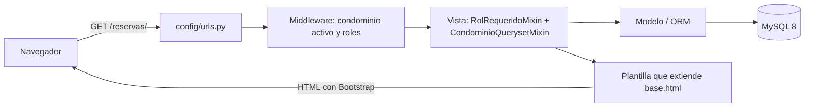
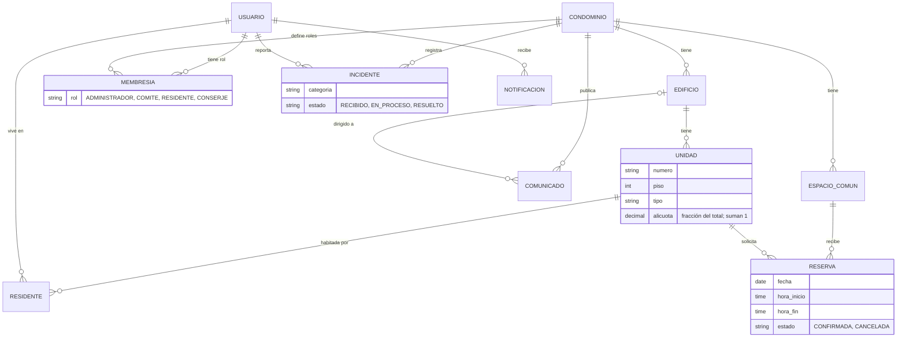
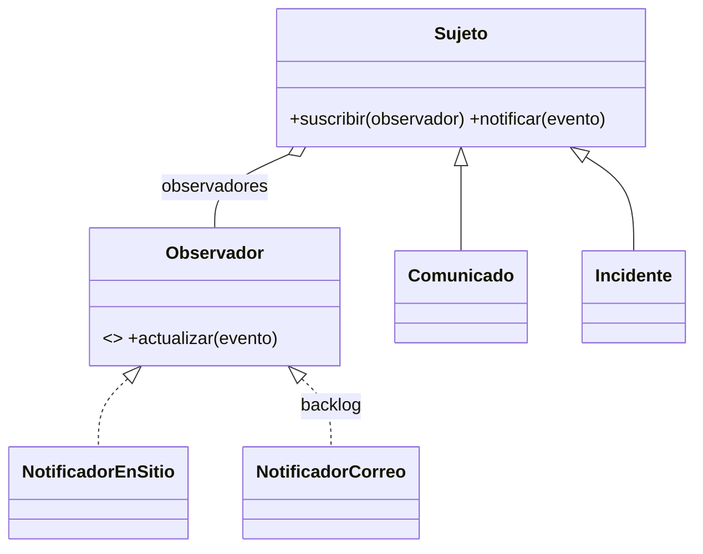

# DOCUMENTACIÓN — CondoHub

Plataforma web de gestión de condominios del equipo **Trinity Codex**
(Walther Mora · Maximiliano Soto · Winderson Castrillo).

## Índice

1. [Alcance de la base](#1-alcance-de-la-base)
2. [Instalación paso a paso](#2-instalación-paso-a-paso)
3. [Arquitectura](#3-arquitectura)
4. [Roles y permisos](#4-roles-y-permisos)
5. [Modelo de datos](#5-modelo-de-datos)
6. [Patrones de diseño](#6-patrones-de-diseño)
7. [Trazabilidad con el Informe 2](#7-trazabilidad-con-el-informe-2)
8. [Pruebas e integración continua](#8-pruebas-e-integración-continua)
9. [Problemas comunes](#9-problemas-comunes)
10. [Seguridad](#10-seguridad)

---

## 1. Alcance de la base

CondoHub implementa el diseño del *Informe 2 de Ingeniería de Software — Sistema de
Administración Comunitaria (Condominio Vista Verde)*, adaptado a **varios condominios**, a
**Django** y a **MySQL**. Esta base deja funcionando la estructura completa (usuarios, roles,
condominios, permisos, diseño, pruebas y CI) y tres módulos de ejemplo; el resto de las
funcionalidades están en el [tablero del proyecto](https://github.com/orgs/Trinity-Codex/projects/1)
como Issues para repartir.

| Incluido en la base | En el backlog (Issues) |
|---|---|
| Inicio de sesión con correo, RUT validado, recuperar contraseña | Gastos comunes con prorrateo y fondo de reserva |
| Condominios, edificios, unidades (alícuota), residentes | Estado de cuenta y registro de pagos |
| Roles por condominio y condominio activo | Reportes de morosidad, aviso de cobro en PDF |
| Comunicados generales o por edificio | Proveedores, remuneraciones y Previred |
| Reservas sin superposición de horarios | Visitas, encomiendas, asambleas |
| Incidentes con estados | Correo, pasarela de pago, API REST, Docker, despliegue |
| Notificaciones en el sitio (patrón Observer) | Administrar unidades y usuarios desde el sitio |

---

## 2. Instalación paso a paso

### 2.1 Requisitos (una sola vez por PC)

| Programa | Versión | Dónde |
|---|---|---|
| **Python** | **3.12** (sirven 3.11 y 3.13) | https://www.python.org/downloads/ — marcar **"Add python.exe to PATH"** |
| **MySQL Server** | **8.0 o superior** | https://dev.mysql.com/downloads/installer/ — instalar *MySQL Server* y *MySQL Workbench*; anotar la clave de `root` |
| **Git** | cualquiera reciente | https://git-scm.com/ |
| VS Code (recomendado) | — | https://code.visualstudio.com/ |

> **¿Usas XAMPP?** XAMPP trae MariaDB 10.4 y **Django 5.2 no funciona con ella** (exige MySQL 8
> o MariaDB 10.5+). Instala MySQL 8 con el instalador de arriba. Ambos usan el puerto 3306: si
> tienes XAMPP abierto, **detén su MySQL** antes de usar CondoHub.

Comprobar lo instalado (en PowerShell):

```bash
py -0
```
```bash
git --version
```

`py -0` debe mostrar una línea con `3.12`. Para MySQL: *Servicios de Windows → MySQL80* debe
estar "En ejecución".

### 2.2 Descargar el proyecto

```bash
git clone https://github.com/Trinity-Codex/Proyecto_CondoHub.git
```
```bash
cd Proyecto_CondoHub
```

### 2.3 Crear la base de datos (una sola vez)

Abre **MySQL Workbench**, conéctate con `root`, abre el archivo
[`docs/crear_base_datos.sql`](docs/crear_base_datos.sql) (*File → Open SQL Script*) y presiona el
rayo ⚡. Crea la base `condohub` y el usuario `condohub` (clave `condohub_dev`).

Alternativa por consola (pide la clave de root):

```bash
Get-Content docs\crear_base_datos.sql | & "C:\Program Files\MySQL\MySQL Server 8.0\bin\mysql.exe" -u root -p
```

### 2.4 Opción A — automática: `iniciar.bat`

Doble clic en **`iniciar.bat`**. Hace todo y muestra en qué paso va:

1. Busca Python 3.12 y crea el entorno virtual `venv`.
2. Instala las librerías de `requirements.txt`.
3. Crea tu archivo `.env` a partir de `.env.example`.
4. Crea las tablas en MySQL (`migrate`).
5. Carga los datos de demostración (solo la primera vez).
6. Levanta el servidor y abre http://127.0.0.1:8000/.

Para detener el servidor: **Ctrl + C** en la ventana negra.

### 2.5 Opción B — manual (para entender cada paso)

```bash
py -3.12 -m venv venv
```
```bash
.\venv\Scripts\Activate.ps1
```
> Si PowerShell bloquea la activación: `Set-ExecutionPolicy -Scope CurrentUser RemoteSigned` (una vez).

```bash
pip install -r requirements.txt
```
```bash
copy .env.example .env
```
```bash
python manage.py migrate
```
```bash
python manage.py cargar_demo
```
```bash
python manage.py runserver
```

### 2.6 El archivo `.env` (configuración local)

Cada integrante tiene su propio `.env` (no se sube a GitHub). Si usaste el script SQL tal cual,
**no hay que cambiar nada**.

| Variable | Valor por defecto | Para qué |
|---|---|---|
| `DB_NAME` / `DB_USER` / `DB_PASSWORD` | `condohub` / `condohub` / `condohub_dev` | Conexión a MySQL |
| `DB_HOST` / `DB_PORT` | `127.0.0.1` / `3306` | Servidor MySQL |
| `DJANGO_DEBUG` | `1` | `0` en un servidor real |
| `DJANGO_ALLOWED_HOSTS` | `127.0.0.1,localhost` | Direcciones permitidas |
| `USE_SQLITE` | `0` | `1` = probar sin MySQL |

### 2.7 Usuarios de demostración

`python manage.py cargar_demo` crea dos condominios y un usuario por rol, todos con la clave
**`condohub2026`**. La tabla completa está en el [README](README.md#usuarios-de-demostración).
Para volver a los datos originales: `python manage.py cargar_demo --reiniciar`.

### 2.8 Trabajar otro día

Abrir la carpeta en VS Code → terminal → `.\venv\Scripts\Activate.ps1` → `git pull` →
`python manage.py migrate` (por si un compañero agregó tablas) → `python manage.py runserver`.
O simplemente doble clic en `iniciar.bat`.

---

## 3. Arquitectura

### 3.1 Estructura de carpetas

```
Proyecto_CondoHub/
├── manage.py
├── requirements.txt          # librerías con versiones exactas
├── .env.example              # modelo de la configuración local
├── iniciar.bat               # instala y levanta todo con doble clic
├── config/                   # configuración del proyecto Django
│   ├── settings.py           # apps, MySQL, idioma, seguridad (lee el .env)
│   └── urls.py               # rutas principales (incluye las de cada app)
├── apps/
│   ├── core/                 # panel de inicio, condominio activo, permisos, formularios, datos demo
│   ├── cuentas/              # usuario (inicio con correo, RUT)
│   ├── condominios/          # condominios, edificios, unidades, residentes, roles
│   ├── comunicados/          # MÓDULO DE REFERENCIA para construir los demás
│   ├── reservas/             # espacios comunes y reservas
│   ├── incidentes/           # incidentes de los residentes
│   └── notificaciones/       # notificaciones + patrón Observer
├── templates/                # base.html (diseño común), formularios, paginación, errores
├── static/                   # CSS propio, ícono y manifest de la PWA
├── docs/                     # script SQL y guías
└── .github/workflows/ci.yml  # pruebas automáticas en GitHub con MySQL 8
```

Cada app sigue la misma estructura: `models.py` (tablas), `forms.py` (formularios),
`views.py` (lógica de cada página), `urls.py` (rutas), `templates/<app>/` (HTML),
`admin.py` (panel de Django) y `tests.py` (pruebas).

### 3.2 Recorrido de una petición



### 3.3 Multi-condominio: el "condominio activo"

Todos los datos pertenecen a un condominio. En cada petición, `apps/core/middleware.py` deja en
`request.condominio` el condominio que el usuario está viendo (guardado en la sesión) y en
`request.roles` sus roles en él. Las vistas usan `CondominioQuerysetMixin` para mostrar **solo**
registros de ese condominio. Un usuario con acceso a varios (ej. un administrador que lleva dos
comunidades) los cambia con el selector del menú.

---

## 4. Roles y permisos

Los roles se asignan **por condominio** (modelo `Membresia`): una persona puede ser residente y
miembro del comité en uno, y administradora en otro. El superusuario de la plataforma actúa como
administrador en todos y es el único que entra a `/admin/`.

| Acción | Administrador | Comité | Conserje | Residente |
|---|:-:|:-:|:-:|:-:|
| Ver comunicados | Todos | Todos | Todos | Generales y de su edificio |
| Publicar / editar comunicados | ✅ | | | |
| Ver espacios y disponibilidad | ✅ | ✅ | ✅ | ✅ |
| Reservar espacios | | | | ✅ |
| Ver todas las reservas | ✅ | ✅ | ✅ | Solo las suyas |
| Cancelar reservas | Todas | | | Las suyas |
| Crear / editar espacios comunes | ✅ | | | |
| Reportar incidentes | | | | ✅ |
| Ver incidentes | Todos | Todos | Todos | Solo los suyos |
| Cambiar estado de incidentes | ✅ | | ✅ | |
| Ver unidades y residentes | ✅ | ✅ | | |
| Ver usuarios y darlos de alta con su rol | ✅ | | | |

Se implementa en `apps/core/permisos.py` (`RolRequeridoMixin`, `CondominioQuerysetMixin`,
`tiene_rol`). Sin permiso, el sitio responde **403** ("sin permisos"); un registro de otro usuario
o de otro condominio responde **404** (ni siquiera se revela que existe).

---

## 5. Modelo de datos



Cambios respecto del modelo ER del Informe 2:

| Informe 2 | CondoHub | Motivo |
|---|---|---|
| — | `Condominio` | Multi-condominio: todo cuelga de un condominio |
| `residente` y `administrador` con nombre, RUT y correo | `Usuario` (datos personales) + `Residente` (unidad) + `Membresia` (rol) | Una persona puede tener varios roles y unidades sin duplicar sus datos |
| Índice único `(espacio, fecha, hora_inicio)` | Validación de **superposición real** de horarios + bloqueo de fila al confirmar | El índice no detectaba topes con distinta hora de inicio (10–12 vs 11–13) |
| `gasto_comun`, `detalle_gasto_comun`, `pago` | En el backlog | Se implementan en los Issues de gastos comunes y pagos |

---

## 6. Patrones de diseño

### Observer (implementado) — `apps/notificaciones/observador.py`

Comunicados e incidentes (**sujetos**) avisan cuando ocurre algo; los **observadores** suscritos
reaccionan. Hoy hay uno, `NotificadorEnSitio` (campana del menú). Agregar el correo es crear
`NotificadorCorreo` y suscribirlo en `apps/notificaciones/apps.py`, **sin tocar** comunicados ni
incidentes (Issue de notificaciones por correo).



### Strategy (backlog) — cálculo del prorrateo

El Issue de cálculo de gastos comunes define `EstrategiaProrrateo` con estrategias
intercambiables (por alícuota, partes iguales, por consumo), como propone la sección 5.3 del Informe 2.

---

## 7. Trazabilidad con el Informe 2

| Requerimiento | Estado | Dónde |
|---|---|---|
| RF01 Datos de edificios, unidades y residentes | Base (consulta) + Issue (administrar desde el sitio) | `apps/condominios` |
| RF02 Generar gastos comunes prorrateados | Issue | — |
| RF03 Residente ve su estado de pago | Issue | — |
| RF04 Registrar pagos | Issue | — |
| RF05 Disponibilidad y reserva | ✅ Base | `apps/reservas` |
| RF06 Sin reservas superpuestas | ✅ Base | `Reserva.clean()` y `Reserva.confirmar()` |
| RF07 Reportar incidentes | ✅ Base | `apps/incidentes` |
| RF08 Cambiar estado de incidentes | ✅ Base | `IncidenteDetailView.post()` |
| RF09 Publicar comunicados | ✅ Base | `apps/comunicados` |
| RF10 Notificación automática | ✅ Base (en el sitio) + Issue (correo) | `apps/notificaciones` |
| RF11 Reportes de gastos y morosidad | Issue | — |
| RF12 Datos de acceso del administrador y comité | Hecho (inicio de sesión, roles, alta de usuarios y recuperar contraseña, #11) | `apps/cuentas`, `Membresia` |
| RNF02 Seguridad por roles | ✅ Base | `apps/core/permisos.py` |
| RNF03 / RNF06 Usable en celular y navegadores | ✅ Base | Bootstrap 5 responsive, PWA |
| RNF07 Mantenibilidad | ✅ Base | Apps independientes, guía de nuevos módulos, pruebas y CI |

---

## 8. Pruebas e integración continua

```bash
python manage.py test apps
```

50 pruebas (todas deben pasar antes de abrir un Pull Request) que cubren: RUT, inicio de sesión,
condominio activo, permisos por rol, aislamiento entre condominios, comunicados por edificio,
reglas de reserva y superposición, incidentes, patrón Observer y redirecciones seguras.
`apps/core/pruebas.py` tiene `crear_escenario()` para escribir pruebas nuevas rápido.

En cada push y Pull Request, GitHub Actions ([`ci.yml`](.github/workflows/ci.yml)) levanta un
MySQL 8 limpio, revisa el proyecto y las migraciones, carga los datos demo y ejecuta las pruebas.
La rama `main` está protegida: solo acepta cambios por Pull Request con **1 aprobación** y el CI en verde.

---

## 9. Problemas comunes

| Error / síntoma | Solución |
|---|---|
| `Access denied for user 'condohub'` | No se ejecutó `docs/crear_base_datos.sql`, o el `.env` tiene otra clave |
| `Can't connect to MySQL server on '127.0.0.1'` | Iniciar el servicio MySQL80 (o detener el MySQL de XAMPP si está usando el puerto) |
| `MariaDB 10.5 or later is required` | Estás conectado al MySQL de XAMPP: instala MySQL 8 (sección 2.1) |
| `Unknown database 'condohub'` | Ejecutar `docs/crear_base_datos.sql` |
| `No module named 'django'` / `'dotenv'` | Activar el entorno virtual y `pip install -r requirements.txt` |
| Error al instalar `mysqlclient` | Usar Python 3.12 (tiene instalador listo para Windows): borrar `venv` y crearlo con `py -3.12 -m venv venv` |
| `la ejecución de scripts está deshabilitada` | `Set-ExecutionPolicy -Scope CurrentUser RemoteSigned` |
| `You have unapplied migrations` | `python manage.py migrate` (un compañero agregó tablas) |
| `That port is already in use` | Ya hay un servidor abierto; ciérralo o usa `python manage.py runserver 8001` |
| La página "No tienes permisos" | Tu rol no permite esa acción (ver sección 4) |
| Se ven datos raros después de probar | `python manage.py cargar_demo --reiniciar` |
| `git push` rechazado en `main` | `main` está protegida: crea una rama y abre un Pull Request ([CONTRIBUTING.md](CONTRIBUTING.md)) |

---

## 10. Seguridad

- Las claves van en el `.env` (fuera de GitHub). El repositorio es público: **nunca** subas claves reales.
- Contraseñas cifradas por Django; protección CSRF en todos los formularios.
- Permisos por rol y aislamiento por condominio en todas las vistas, con pruebas que lo verifican.
- Las redirecciones (`volver`, enlaces de notificaciones) solo aceptan direcciones del propio sitio.
- Las reservas se confirman con bloqueo de fila (`select_for_update`) para evitar dobles reservas simultáneas.
- Antes de publicar en internet: `DJANGO_DEBUG=0`, `DJANGO_SECRET_KEY` secreta, HTTPS y
  `python manage.py check --deploy` (Issue de despliegue).
