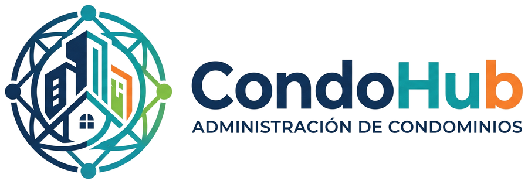

<p align="center"></p>

# CondoHub

[](https://github.com/Trinity-Codex/Proyecto_CondoHub/actions/workflows/ci.yml)

Plataforma web de **gestión de condominios**: gastos comunes, pagos, reportes de morosidad,
comunicados, reservas de espacios comunes, incidentes y notificaciones, con soporte para
**varios condominios** y **roles** (administrador, comité, residente y conserje).

Implementa el diseño del *Informe 2 de Ingeniería de Software — Sistema de Administración
Comunitaria (Condominio Vista Verde)*: requerimientos RF01–RF12, modelo de datos y los patrones
**Observer** (notificaciones en el sitio y por correo) y **Strategy** (prorrateo de los gastos comunes).

**Equipo Trinity Codex:** Walther Mora · Maximiliano Soto · Winderson Castrillo

## Tecnologías

| Capa | Tecnología |
|---|---|
| Backend | Python 3.12 · Django 5.2 LTS |
| Frontend | Plantillas de Django · Bootstrap 5 · Bootstrap Icons (responsive, instalable como PWA) |
| Base de datos | MySQL 8 |
| Pruebas | Django TestCase · GitHub Actions con MySQL 8 |

## Inicio rápido (Windows)

Requisitos: **Python 3.12**, **MySQL 8** y **Git**.

1. Clonar el repositorio:
   ```bash
   git clone https://github.com/Trinity-Codex/Proyecto_CondoHub.git
   ```
2. Crear la base de datos y el usuario de MySQL (**una sola vez**): ejecutar
   [`docs/crear_base_datos.sql`](docs/crear_base_datos.sql) en MySQL Workbench con el usuario `root`.
3. Doble clic en **`iniciar.bat`**: crea el entorno virtual, instala las librerías, crea las
   tablas, carga los datos de demostración y abre http://127.0.0.1:8000/.

### Usuarios de demostración

Todos con la clave **`condohub2026`**:

| Correo | Rol |
|---|---|
| `administrador@condohub.cl` | Administrador de **dos** condominios (prueba el selector del menú) |
| `comite@condohub.cl` | Comité de administración (y residente de A-201) |
| `conserje@condohub.cl` | Conserje |
| `residente@condohub.cl` | Residente propietario de A-101 |
| `residente2@condohub.cl` | Residente arrendatario de B-102 |
| `residente3@condohub.cl` | Residente del otro condominio (Edificio Los Aromos) |
| `superadmin@condohub.cl` | Superusuario de la plataforma (`/admin/`) |

## Funcionalidades

| Módulo | Qué hace | Requerimientos |
|---|---|---|
| Cuentas | Inicio de sesión con correo, RUT validado, alta de usuarios por el administrador, recuperar contraseña y perfil | RF12, RNF02 |
| Condominios | Condominios, edificios, unidades con alícuota, residentes y roles por condominio | RF01 |
| Gastos comunes | Egresos del mes, emisión con prorrateo por alícuota o partes iguales (**Strategy**) y fondo de reserva | RF02 |
| Pagos | Estado de cuenta del residente, cobranza por unidad y registro de pagos totales o parciales | RF03, RF04 |
| Reportes | Recaudación y morosidad por período y edificio, con descarga en CSV para Excel | RF11 |
| Proveedores | Proveedores con RUT validado, vinculados a los egresos | — |
| Comunicados | Publicar comunicados generales o por edificio | RF09 |
| Reservas | Disponibilidad por fecha y reservas **sin superposición de horarios** | RF05, RF06 |
| Incidentes | Reportar incidentes y cambiar su estado (recibido → en proceso → resuelto) | RF07, RF08 |
| Notificaciones | Campana y correo con los avisos de cada módulo (**Observer**) | RF10 |

Los 12 requerimientos funcionales del Informe 2 están implementados (trazabilidad en la
[sección 7 de DOCUMENTACION.md](DOCUMENTACION.md#7-trazabilidad-con-el-informe-2)). Las mejoras de la
fase 2 están en los [Issues](https://github.com/Trinity-Codex/Proyecto_CondoHub/issues) y en el tablero del proyecto.

## Pruebas

```bash
python manage.py test apps
```

241 pruebas; GitHub Actions las ejecuta con MySQL 8 en cada Pull Request.

## Documentación

- [DOCUMENTACION.md](DOCUMENTACION.md): instalación paso a paso, arquitectura, roles, modelo de datos, trazabilidad con el Informe 2 y problemas comunes.
- [CONTRIBUTING.md](CONTRIBUTING.md): cómo trabajamos con ramas, Pull Requests y revisiones.
- [docs/GUIA_NUEVA_FEATURE.md](docs/GUIA_NUEVA_FEATURE.md): receta para agregar un módulo nuevo.
- [Tablero del proyecto](https://github.com/orgs/Trinity-Codex/projects/1): tareas de la entrega y mejoras de la fase 2.
- [docs/equipo/](docs/equipo/PLAN_DE_TRABAJO.md): plan de trabajo, calendario y guía de inicio de cada integrante.
