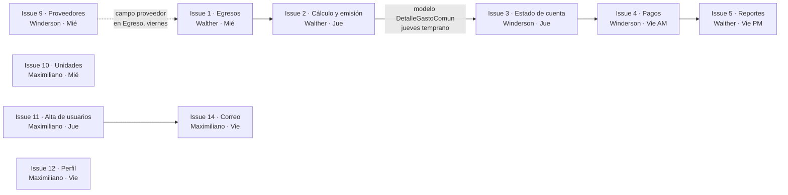

# Plan de trabajo — Entrega del sábado 10 de octubre

**Equipo Trinity Codex:** Walther Mora · Maximiliano Soto · Winderson Castrillo

**Objetivo:** que el sábado CondoHub tenga implementados **todos los requerimientos funcionales
del Informe 2 (RF01 a RF12)**. La base (inicio de sesión, roles, condominios, comunicados,
reservas, incidentes y notificaciones) ya está lista; faltan 10 Issues.

| Día | Uso |
|---|---|
| **Miércoles 7, jueves 8 y viernes 9** | Desarrollo |
| **Sábado 10** | Pruebas finales, ajustes y entrega (20:00, por confirmar). Es la **holgura** si alguien se atrasa |

Instrucciones personales (preparar el entorno, tareas y calendario de cada uno):
[Maximiliano](Maximiliano_Soto.md) · [Winderson](Winderson_Castrillo.md) · [Walther](Walther_Mora.md)

---

## 1. Tabla general de tareas

| Issue | Tarea | Responsable | Día | Depende de | Requerimiento |
|---|---|---|---|---|---|
| [#1](https://github.com/Trinity-Codex/Proyecto_CondoHub/issues/1) | Registrar los egresos del mes | Walther | Miércoles 7 | — | RF02 |
| [#9](https://github.com/Trinity-Codex/Proyecto_CondoHub/issues/9) | Gestión de proveedores | Winderson | Miércoles 7 | — | — |
| [#10](https://github.com/Trinity-Codex/Proyecto_CondoHub/issues/10) | Administrar edificios, unidades y residentes desde el sitio | Maximiliano | Miércoles 7 | — | RF01 |
| [#2](https://github.com/Trinity-Codex/Proyecto_CondoHub/issues/2) | Calcular y emitir gastos comunes (Strategy + fondo de reserva) | Walther | Jueves 8 | #1 | RF02 |
| [#3](https://github.com/Trinity-Codex/Proyecto_CondoHub/issues/3) | Estado de cuenta del residente | Winderson | Jueves 8 | Modelo `DetalleGastoComun` de #2 | RF03 |
| [#11](https://github.com/Trinity-Codex/Proyecto_CondoHub/issues/11) | Alta de usuarios y recuperación de contraseña | Maximiliano | Jueves 8 | — | RF12 |
| [#4](https://github.com/Trinity-Codex/Proyecto_CondoHub/issues/4) | Registrar pagos (registro manual) | Winderson | Viernes 9 (mañana) | #3 | RF04 |
| [#5](https://github.com/Trinity-Codex/Proyecto_CondoHub/issues/5) | Reporte de gastos comunes y morosidad | Walther | Viernes 9 (tarde) | #2 y #4 | RF11 |
| [#12](https://github.com/Trinity-Codex/Proyecto_CondoHub/issues/12) | Perfil de usuario | Maximiliano | Viernes 9 | — | — |
| [#14](https://github.com/Trinity-Codex/Proyecto_CondoHub/issues/14) | Notificaciones por correo (patrón Observer) | Maximiliano | Viernes 9 | #11 (configuración de correo) | RF10 |

El detalle de cada tarea (qué hacer y **criterios de aceptación**) está en su Issue. Las 10 están
en el hito [Entrega 10-oct](https://github.com/Trinity-Codex/Proyecto_CondoHub/milestone/1) y en el
[tablero](https://github.com/orgs/Trinity-Codex/projects/1) con el campo **"Día planificado"**.

## 2. Calendario

| | Walther | Maximiliano | Winderson |
|---|---|---|---|
| **Miércoles 7** | #1 Egresos | #10 Unidades y residentes | #9 Proveedores |
| **Jueves 8** | **Primero:** PR corto con el modelo `DetalleGastoComun`. Después: #2 Cálculo y emisión | #11 Alta de usuarios y contraseña | #3 Estado de cuenta (apenas esté el modelo de Walther en `main`) |
| **Viernes 9** | #5 Reportes (tarde, cuando #4 esté en `main`) | #12 Perfil → #14 Correo | #4 Pagos (mañana) → conectar proveedor con egresos |
| **Sábado 10** | Pruebas finales, datos demo de los módulos nuevos, documentación y entrega | Pruebas y revisiones | Pruebas y revisiones |

### Puntos de encuentro (dependencias)



1. **Jueves temprano**, Walther abre un PR corto que solo agrega el modelo `DetalleGastoComun`
   (el cobro de cada unidad). Sin él, Winderson no puede empezar #3 ni #4.
2. **#1 y #9 se conectan al final:** Walther hace los egresos sin el campo proveedor. El
   viernes, con ambos en `main`, Winderson agrega el campo `proveedor` a `Egreso`.
3. **#5 usa los pagos de #4:** Winderson une #4 el viernes en la mañana para que Walther haga los
   reportes en la tarde.

### Contrato del modelo `DetalleGastoComun` (Walther lo crea; Winderson lo usa)

Para que Winderson pueda avanzar #3 y #4 sin esperar el resto de #2, ambos acuerdan desde ya cómo
será el modelo que Walther sube el **jueves temprano** en `apps/gastos/models.py`:

```python
class DetalleGastoComun(models.Model):
    """Cobro de gastos comunes de UNA unidad en UN período."""

    class Estado(models.TextChoices):
        PENDIENTE = "PENDIENTE", "Pendiente"
        PAGADO = "PAGADO", "Pagado"
        MOROSO = "MOROSO", "Moroso"

    periodo = models.ForeignKey("gastos.PeriodoGasto", on_delete=models.CASCADE, related_name="detalles")
    unidad = models.ForeignKey("condominios.Unidad", on_delete=models.CASCADE, related_name="cobros")
    monto = models.PositiveIntegerField()               # parte de los gastos del período (pesos)
    monto_fondo_reserva = models.PositiveIntegerField() # aporte al fondo de reserva (pesos)
    estado = models.CharField(max_length=10, choices=Estado.choices, default=Estado.PENDIENTE)

    class Meta:
        constraints = [models.UniqueConstraint(fields=["periodo", "unidad"], name="uq_detalle_periodo_unidad")]

    @property
    def total(self):
        """Lo que la unidad debe pagar en el período."""
        return self.monto + self.monto_fondo_reserva
```

`PeriodoGasto` tiene `condominio`, `anio`, `mes` y `estado` (ABIERTO / EMITIDO). Si hay que cambiar
algo de este contrato, se conversa entre ambos antes de hacerlo.

## 3. Quién es dueño de qué archivos

Para no pisarse, cada uno trabaja en **sus** apps. Los archivos compartidos se tocan lo mínimo.

| Responsable | Apps / archivos propios |
|---|---|
| Walther | `apps/gastos/` (nueva): períodos, egresos, cálculo, emisión, reportes |
| Winderson | `apps/proveedores/` (nueva) y `apps/pagos/` (nueva): estado de cuenta y pagos |
| Maximiliano | `apps/condominios/`, `apps/cuentas/` y `apps/notificaciones/` |

**Archivos compartidos** (cambios pequeños, de una o dos líneas):

| Archivo | Qué agrega cada uno |
|---|---|
| `config/settings.py` | Su app en `INSTALLED_APPS` (Maximiliano además la configuración de correo) |
| `config/urls.py` | La ruta de su app |
| `templates/base.html` | El enlace de su módulo en el menú |
| `apps/core/management/commands/cargar_demo.py` | Datos demo de su módulo en un método propio `_demo_<modulo>()` (sábado) |

Antes de abrir un PR, actualiza tu rama con `main` (ver [CONTRIBUTING.md](../../CONTRIBUTING.md)).
Si aparece un **conflicto** en un archivo compartido, normalmente basta con conservar **las dos**
líneas (la tuya y la del compañero). Si dudas, pregunta en el grupo antes de resolverlo.

## 4. Reglas del equipo

1. **Reunión diaria de 15 minutos** (Scrum, como en el Informe 2), a una hora fija que acuerden:
   qué hice, qué haré hoy y qué me bloquea.
2. **Nadie sube cambios directo a `main`:** rama → Pull Request → 1 aprobación → pruebas en verde → *Squash and merge*.
3. **Revisiones el mismo día**, en rotación:

   | Quien abre el PR | Lo revisa |
   |---|---|
   | Walther | Maximiliano |
   | Maximiliano | Winderson |
   | Winderson | Walther |

4. **Pruebas siempre:** cada Issue lleva sus pruebas y `python manage.py test apps` debe pasar completo.
5. **Si te bloqueas más de 30 minutos, avisa.** Es mejor pedir ayuda temprano que atrasar a los demás.
6. **Si terminas antes,** toma #15 (fotos en incidentes) o #21 (encomiendas): son pequeñas.
7. **Cierre del viernes:** todo lo terminado queda unido a `main` antes de dormir. El sábado es
   para probar y corregir, no para empezar funcionalidades nuevas.

## 5. Sábado 10: pruebas finales y entrega

| Hora (aprox.) | Actividad |
|---|---|
| Mañana | Terminar lo atrasado (si lo hay) y unir los últimos PR |
| 14:00 – 17:00 | Integración: cada uno agrega sus datos demo y prueba los flujos completos con todos los roles |
| 17:00 – 19:00 | Corrección de errores, actualizar README y DOCUMENTACION (trazabilidad de RF) |
| **19:00** | **Congelamiento:** no se une nada más salvo correcciones críticas |
| **20:00** | Entrega |

## 6. Fase 2 (después de la entrega)

El resto del backlog queda para la etapa de evaluación de proyectos, en el tablero con
"Día planificado = Fase 2":

| Prioridad | Issues |
|---|---|
| Media | #6 Aviso de cobro PDF · #8 Fondo de reserva · #13 Importar CSV · #15 Fotos · #17 Reglas de reserva · #20 Visitas · #21 Encomiendas · #29 Despliegue |
| Baja | #7 Intereses · #16 Documentos · #18 Tarifa de reservas · #19 Calendario · #22 Asambleas · #23 Remuneraciones y Previred · #24 Pasarela de pago · #25 API REST · #26 PWA sin conexión · #27 Auditoría · #28 Docker |
